# ☁️ NimbusDrive

### AI-Powered Cloud Storage Platform

A Google Drive–inspired cloud storage platform with a voice assistant, intelligent file organization, and instant file sharing over Email, WhatsApp, and SMS — built on AWS infrastructure for scale and security.

<div align="center">

[](https://amazing-kangaroo-ec32f7.netlify.app/)


</div>

---

## 📌 About the Project

**NimbusDrive** is a full-stack, cloud-native file storage and sharing platform built to demonstrate a production-style AWS architecture.

Users can sign up, upload files of any type, organize and search them — including through voice — track storage usage in real time, and share files securely through expiring links sent via WhatsApp, Email, or copy-link.

The entire system is deployed across managed cloud services rather than a single server:

* **AWS S3** — Object storage
* **AWS DynamoDB** — Application database
* **AWS IAM** — Access control
* **AWS Shield** — DDoS protection
* **AWS EC2** — Compute infrastructure
* **Render** — Backend deployment
* **Netlify** — Frontend deployment

> 🗓️ **Built:** December 2025 – January 2026

---

## ✨ Key Features

* 🔐 **Authentication** – Secure sign up / sign in with hashed credentials
* 🎙️ **AI Voice Assistant & Voice Search** – Search or manage files hands-free using speech input
* 📤 **Drag-and-Drop Upload** – Supports any file type including images, videos, audio, documents, and archives
* 🗂️ **Smart File Management** – View, rename, download, or delete files with a single click
* 🔗 **Multi-Channel Sharing** – Share files via **WhatsApp**, **Email**, or a copyable link
* 🔒 **Configurable Share Links** – Toggle links between **Private** / **Public** and set custom expiry windows
* 📊 **Real-Time Storage Analytics** – Live dashboard showing used vs. available storage, file counts, and usage graphs
* 🗑️ **Recovery & Backup** – Trash, spam filtering, and file recovery tools
* 📱 **Responsive UI** – Collapsible sidebar navigation for mobile and desktop
* ☁️ **Cloud-Native Backend** – Built on AWS for scalability, durability, and high availability

---

## 🖼️ Screenshots

> All screenshots are displayed consistently at **800 × 450 px** for a clean and professional README layout.

<div align="center">

### 🔐 Sign In

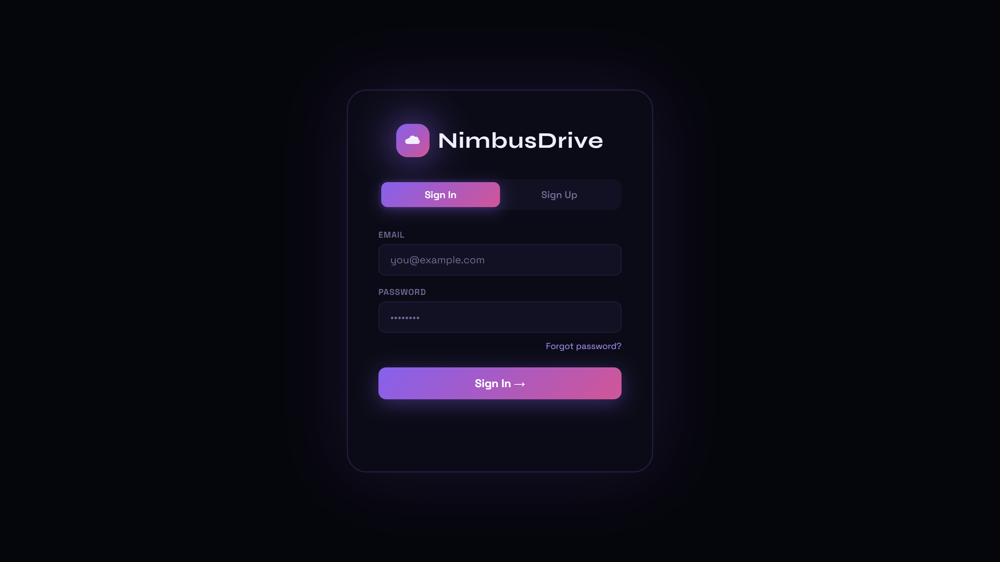

---

### 📊 Dashboard — Storage Overview

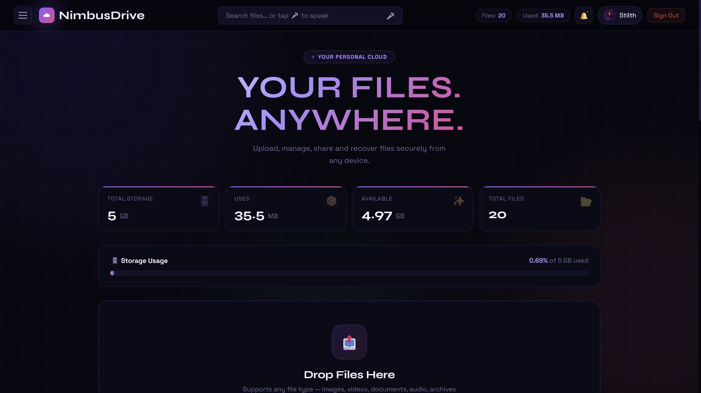

---

### 📁 File Manager

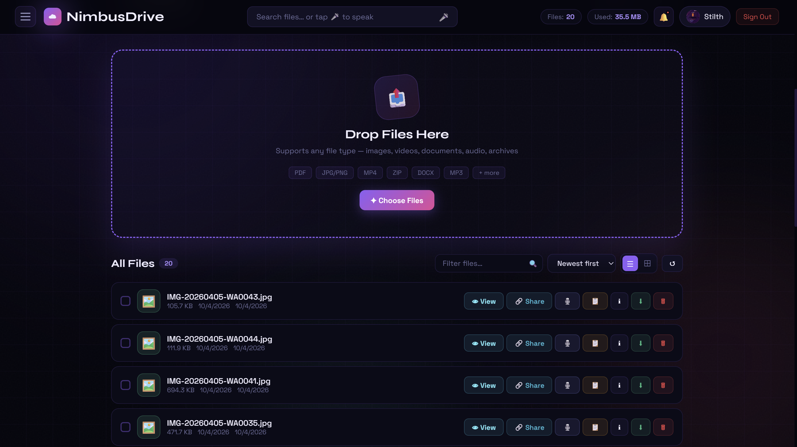

---

### ☰ Sidebar Navigation

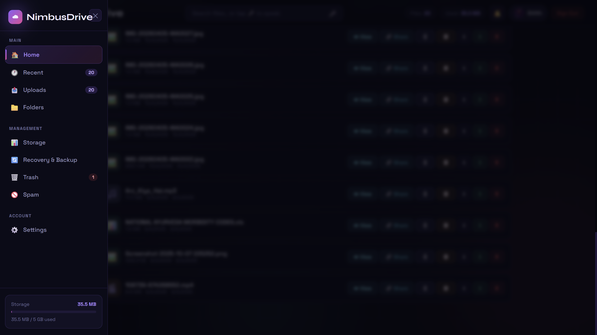

---

### 🔗 Share File Modal

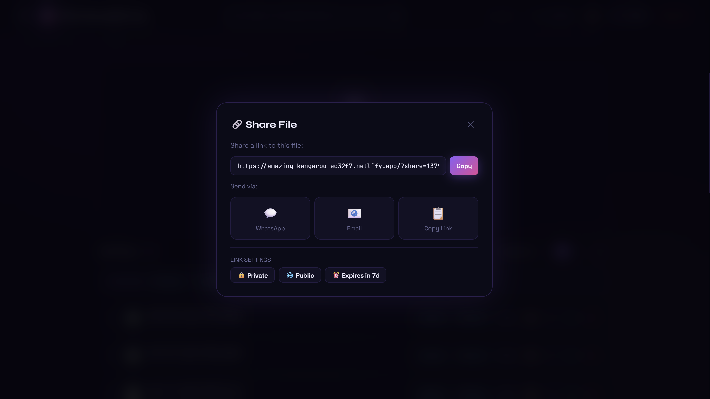

---

### 🌐 Publicly Shared Files Page

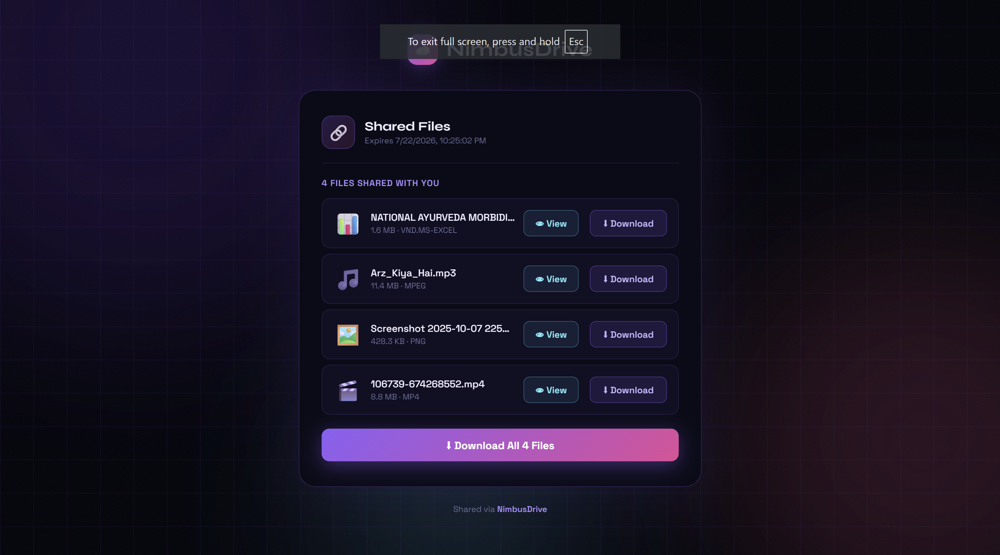

</div>

---

## 🏗️ Tech Stack & Architecture

| Layer              | Technology                                |
| ------------------ | ----------------------------------------- |
| **Frontend**       | React.js, deployed on **Netlify**         |
| **Backend**        | Node.js / Express, deployed on **Render** |
| **Database**       | **AWS DynamoDB**                          |
| **File Storage**   | **AWS S3**                                |
| **Access Control** | **AWS IAM**                               |
| **Security**       | **AWS Shield**                            |
| **Compute**        | **AWS EC2**                               |

---

## ☁️ AWS Infrastructure in Action

### AWS Console

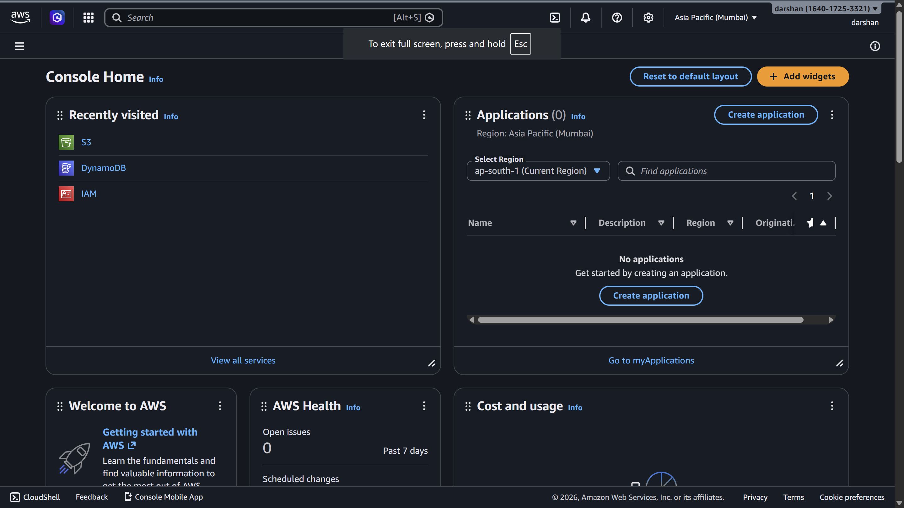

### Amazon S3

Every user gets an isolated folder keyed by UUID inside the storage bucket for their uploaded files.

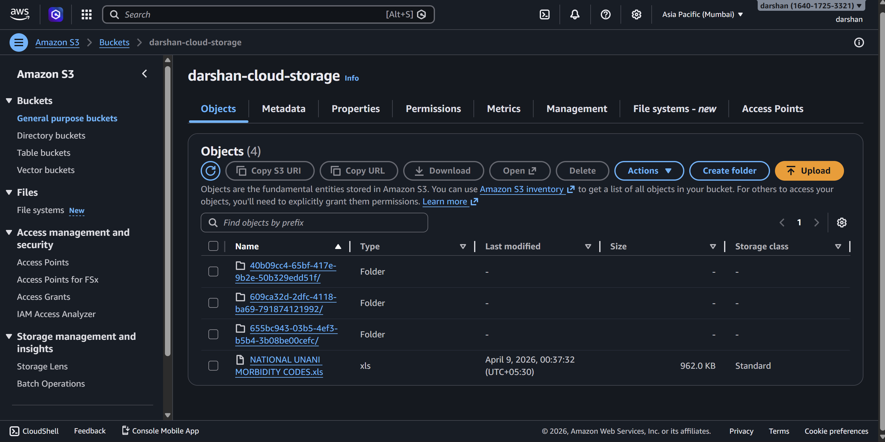

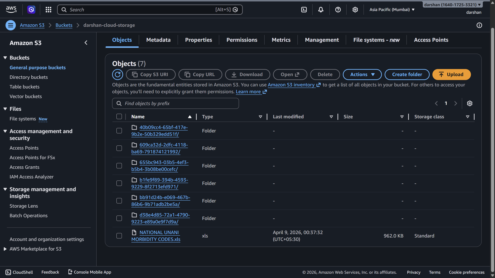

---

## 🗄️ Amazon DynamoDB

Three core tables power the application:

| Table           | Partition Key | Sort Key     | Purpose                                       |
| --------------- | ------------- | ------------ | --------------------------------------------- |
| `nimbus-users`  | `userId` (S)  | –            | Stores user profile & authentication data     |
| `nimbus-files`  | `userId` (S)  | `fileId` (S) | Tracks metadata for every uploaded file       |
| `nimbus-shares` | `shareId` (S) | –            | Manages share links, expiry, and linked files |

### DynamoDB Tables

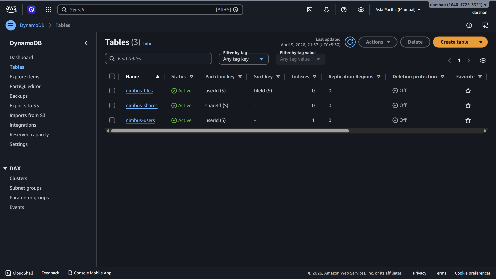

### DynamoDB Shares

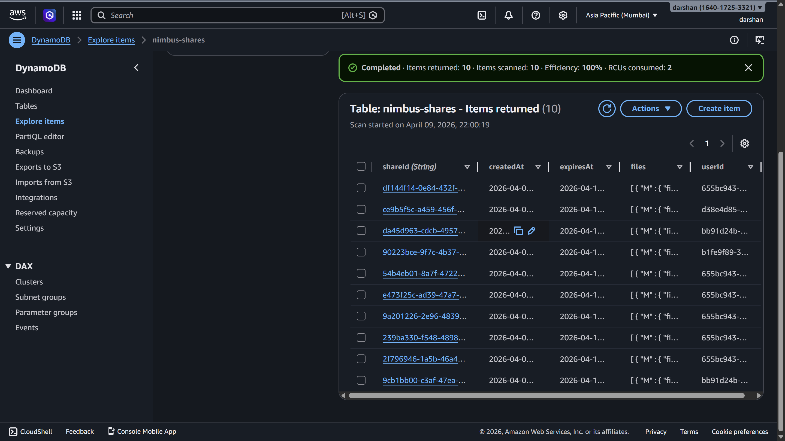

> 🔒 **Security Note:** Credentials, password hashes, and personal user data shown during development have been excluded from this README. Never commit real `.env` values, access keys, or database exports to a public repository.

---

## 🔄 High-Level Architecture Flow

```text
┌────────────┐       HTTPS       ┌────────────────┐
│  React UI  │ ─────────────────▶│  Node/Express  │
│  (Netlify) │◀───────────────── │   (Render)     │
└────────────┘                   └───────┬────────┘
                                         │
                    ┌────────────────────┼────────────────────┐
                    ▼                    ▼                    ▼
             ┌─────────────┐     ┌───────────────┐    ┌───────────────┐
             │   AWS S3    │     │  AWS DynamoDB │    │   AWS IAM /   │
             │ File Store  │     │   App Data    │    │  AWS Shield   │
             └─────────────┘     └───────────────┘    └───────────────┘
```

---

## 📁 Repository Structure

```text
nimbusdrive/
│
├── backend/
│   ├── routes/
│   ├── controllers/
│   ├── middleware/
│   ├── config/
│   └── server.js
│
├── final frontend/
│   ├── public/
│   ├── src/
│   ├── components/
│   └── package.json
│
├── screenshots/
│   └── screenshots/
│       ├── auth-signin.png
│       ├── dashboard-overview.png
│       ├── file-manager.png
│       ├── sidebar-navigation.png
│       ├── share-file-modal.png
│       ├── shared-files-page.png
│       ├── aws-console-home.png
│       ├── aws-s3-bucket.png
│       ├── aws-s3-objects.png
│       ├── aws-dynamodb-tables.png
│       └── aws-dynamodb-shares.png
│
└── README.md
```

---

## 🚀 Getting Started

### Prerequisites

Before running NimbusDrive locally, make sure you have:

* Node.js **v18+**
* An AWS account
* An AWS S3 bucket
* AWS DynamoDB tables
* AWS IAM credentials with appropriate permissions

---

### 1. Clone the Repository

```bash
git clone https://github.com/darshanthorat6450/nimbusdrive.git
cd nimbusdrive
```

---

### 2. Backend Setup

Navigate to the backend directory:

```bash
cd backend
npm install
```

Create a `.env` file inside the `backend/` directory:

```env
AWS_ACCESS_KEY_ID=your_access_key
AWS_SECRET_ACCESS_KEY=your_secret_key
AWS_REGION=ap-south-1

S3_BUCKET_NAME=your-bucket-name

DYNAMODB_USERS_TABLE=nimbus-users
DYNAMODB_FILES_TABLE=nimbus-files
DYNAMODB_SHARES_TABLE=nimbus-shares

PORT=5000
```

Start the backend:

```bash
npm start
```

The backend will run on:

```text
http://localhost:5000
```

---

### 3. Frontend Setup

Open another terminal and navigate to the frontend:

```bash
cd "final frontend"
npm install
```

Start the React application:

```bash
npm start
```

The frontend will run on:

```text
http://localhost:3000
```

The frontend connects to the Node.js / Express backend running on port `5000`.

---

## 🌐 Live Deployment

| Service             | Platform     |
| ------------------- | ------------ |
| **Frontend**        | Netlify      |
| **Backend API**     | Render       |
| **Storage**         | AWS S3       |
| **Database**        | AWS DynamoDB |
| **Access Control**  | AWS IAM      |
| **DDoS Protection** | AWS Shield   |
| **Compute**         | AWS EC2      |

### 🚀 Live Demo

<div align="center">

[](https://amazing-kangaroo-ec32f7.netlify.app/)

</div>

---

## 🗺️ Roadmap

* [ ] Two-factor authentication
* [ ] Real-time collaborative file previews
* [ ] Folder-level sharing permissions
* [ ] Usage analytics dashboard for administrators
* [ ] Mobile application using React Native
* [ ] Advanced AI-powered file categorization
* [ ] AI-based duplicate file detection
* [ ] Enhanced file preview system
* [ ] Activity and audit logs

---

## 🤝 Contributing

Contributions, issues, and feature requests are welcome.

### Contribution Steps

1. Fork the project
2. Clone your fork
3. Create a feature branch

```bash
git checkout -b feature/amazing-feature
```

4. Commit your changes

```bash
git commit -m "Add amazing feature"
```

5. Push the branch

```bash
git push origin feature/amazing-feature
```

6. Open a Pull Request

---

## 🐛 Issues & Feature Requests

If you find a bug or have an idea for a new feature, feel free to open an issue.

[](https://github.com/darshanthorat6450/nimbusdrive/issues)

---

## 📄 License

This project is currently **unlicensed**.

If you want to allow others to freely use, modify, and distribute the project, consider adding an **MIT License**.

---

## 👤 Author

<div align="center">

### Darshan Thorat

Computer Engineering Student
Cloud • Full Stack • AI/ML • AWS

[](https://github.com/darshanthorat6450)

</div>

---

<div align="center">

⭐ **If you found NimbusDrive interesting, consider giving the repository a star!**

Made with ❤️ using React, Node.js & AWS

</div>
